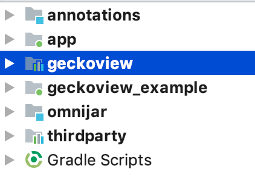

# GeckoView Quick Start Guide

## Get set up with Mozilla Central

The GeckoView codebase is part of the main Firefox tree and can be found in `mozilla-central`. You will need to get set up as a contributor to Firefox in order to contribute to GeckoView. To get set up, follow the [Quick Start Guide for Git Users](MozCentralQuickStart.md), or the [Contributing to the Mozilla code base](https://developer.mozilla.org/docs/Mozilla/Developer_guide/Introduction) guide on [MDN](https://developer.mozilla.org/) for Mercurial users.

Once you have a copy of `mozilla-central`, you will need to build GeckoView.

## Bootstrap Gecko
Bootstrap configures everything for GeckoView and Fennec development.

* Ensure you have central checked out. If this is the first time you are doing this, it may take some time.

```bash
git checkout central/default
```
If you are on a mac, you will need to have the Xcode build tools installed. You can do this by either [installing Xcode](https://developer.apple.com/xcode/) or installing only the tools from the command line by running `xcode-select --install` and following the on screen instructions. Use the ` --no-interactive` argument to automatically accept any license agreements.

```bash
./mach bootstrap [ --no-interactive]
```
* Choose option `4. Firefox for Android` for GeckoView development. This will give you a version of Gecko configured for Android that has not bundled the native code into embedded libraries so you can amend the code.
* Say Y to all configuration options
* Edit your `mozconfig` - this can be found in the root of your `gecko` repo - or create a file called `mozconfig` if it does not exist. Change it to read as follows:

```bash
mk_add_options MOZ_OBJDIR=./objdir-frontend

# Add the correct paths here:
ac_add_options --with-android-sdk="$HOME/.mozbuild/android-sdk-macosx"

# android options
ac_add_options --enable-application=mobile/android
ac_add_options --target=i686-linux-android

ac_add_options --disable-debug

ac_add_options --enable-artifact-builds

```
* Configure your build.

```bash
./mach configure
```
## Build from the command line

In order to pick up the configuration changes we just made we need to build from the command line and package the app.

```bash
./mach build
./mach package
```

## Archive GeckoView

If you want to include GeckoView as a dependency inside another app, you must archive it. To create the GeckoView AAR type the following into the command line:

```bash
./mach android archive-geckoview
```

This should create a file named geckoview-*.aar in your build output folder (MOZ_OBJDIR):

```bash
ls <your-output-directory>/gradle/build/mobile/android/geckoview/outputs/aar
geckoview-official-withGeckoBinaries-noMinApi-release.aar
```

Then all you need to do is point to the AAR in your gradle file.

```json
repositories {
    // ...

    flatDir(
        name: 'localBuild',
        dirs: '<absolute path to AAR>'
    )
}
// ...
dependencies {
    // ...

    // armImplementation "org.mozilla:geckoview-nightly-armeabi-v7a:60.0a1"
    armImplementation (
            name: 'geckoview-official-withGeckoBinaries-noMinApi-release',
            ext: 'aar'
    )
    x86Implementation "org.mozilla:geckoview-nightly-x86:60.0a1"
    
    // ...
}
```

## Build Using Android Studio

* Install [Android Studio](https://developer.android.com/studio/install).
* Disable Instant Run. This is because Fennec and the Geckoview Example app cannot deploy with Instant Run on.
  * Select Android Studio > Preferences from the menu bar
  * Navigate to Build, Execution, Deployment > Instant Run.
  * Uncheck the box that reads `Enable Instant Run to hot swap code/resource changes on deploy`.
  
* Choose File->Open from the toolbar
* Navigate to <path to gecko>/mobile/android/geckoview and click "Open"
* Click yes if it asks if you want to use the gradle wrapper.
* Wait for the project to index and gradle to sync. Once synced, the workspace will reconfigure to display the different projects.
  * annotations contains custom annotations used inside GeckoView and Fennec.
  * app is Fennec - Firefox for Android. Here is where you will find code specific to that app.
  * geckoview is the GeckoView project. Here is all the Java files related to GeckoView
  * geckoview_example is an example browser built using GeckoView.
  * omnijar contains the parts of Gecko and GeckoView that are not written in Java or Kotlin
  * thirdparty contains third party code that Fennec and GeckoView use.
  

Now you're set up and ready to go.

## Performing a bug fix

One you have got GeckoView building and running, you will want to start contributing. There is a general guide to [Performing a Bug Fix for Git Developers](ContributingToMC.md) for you to follow. To contribute to GeckoView you will need the following information.

If you are submitting a patch to `try` before submitting it for review, the GeckoView `try` syntax is as follows:
```
```

When submitting a patch to Phabricator, if you know who you want to review your patch, put their Phabricator handle against the `reviewers` field. 

If you didn't put a reviewer into the intial patch message when submitting, follow the link to the patch in Phabricator and scroll to the bottom of the screen until you see the comment box. 
  * Select the `Add Action` drop down and pick the `Change Reviewers` option.
  * In the presented box, add `geckoview-reviewers`. Selecting this group as the reviewer will notify all the members of the GeckoView team there is a patch to review.
  * Click `Submit` to submit the reviewer change request.
